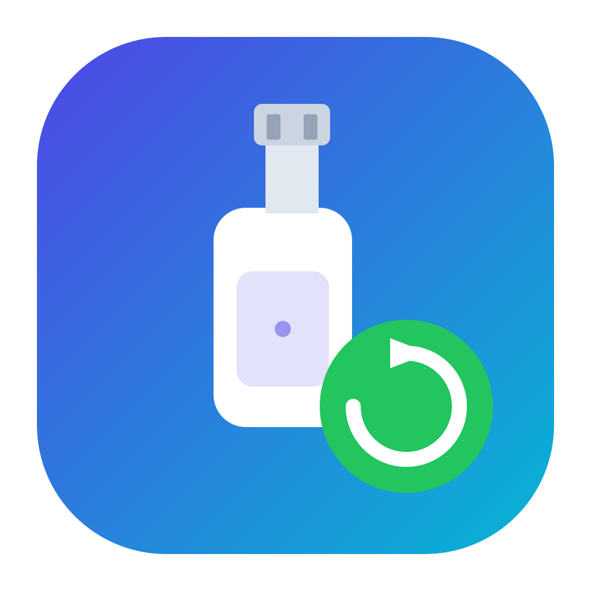

<div align="center">



# AshDrive

**Plug in a flash drive → it backs itself up.**

AshDrive watches for your USB / flash drives and backs them up automatically — on **Windows** and **macOS**.

[](https://github.com/Hamacross/AshDrive/actions/workflows/build.yml)
[](#)
[](LICENSE)

</div>

---

AshDrive lives in your system tray (or macOS menu bar) and watches for drives you've set up. When you plug one in, it either asks *"Back up to &lt;folder&gt;?"* or backs it up immediately and sends a notification. Backups are **incremental** — only new or changed files are copied — so repeat backups are fast, and your backup folder is always a safe, complete copy of the drive.

## ✨ Features

- **Automatic, hands-off backups** — plug in a configured drive and AshDrive does the rest.
- **Two modes per drive:**
  - _Ask_ — prompts you (notification + in-app banner) before backing up.
  - _Auto_ — backs up on insertion and just notifies you when it's done.
- **Incremental copies** — skips files that match on size + modified time; nothing is ever deleted from the backup.
- **Cross-platform** — one app, one codebase, native notifications + tray on Windows and macOS.
- **System-tray menu** with _Back up now_ for any plugged-in drive.
- **Runs at login** (optional) so it's always watching.
- **No native modules** — drive detection uses built-in OS tools (PowerShell on Windows, `diskutil` on macOS), so it builds cleanly and there's nothing to compile.

## 📦 Install

### Windows
Run **`AshDrive-Setup-1.0.0.exe`** and follow the installer.

> The app is unsigned, so Windows SmartScreen may warn on first launch — click **More info → Run anyway**. A portable copy (`AshDrive.exe`) is also in `dist/win-unpacked/`.

### macOS
Open **`AshDrive-1.0.0-universal.dmg`**, drag **AshDrive** to **Applications**.

> Unsigned on macOS too: right-click the app → **Open** → **Open** the first time, or run
> `xattr -dr com.apple.quarantine /Applications/AshDrive.app`

## 🚀 Usage

1. Launch AshDrive — it appears in your tray / menu bar.
2. Click **Add drive**:
   - Pick the detected flash drive.
   - Choose a **backup folder**.
   - Give it a name.
   - Toggle **Back up automatically** on or off.
3. That's it. Unplug and re-plug the drive — AshDrive backs it up (or asks first, depending on the mode).

A drive is recognised by its **volume label + size**, so it stays "your drive" even if Windows assigns it a different letter next time.

## 🛠️ Run from source

Requirements: **Node.js 18+** (tested on Node 20 / 22).

```bash
npm install
npm run icon      # generate app + tray icons (one-time)
npm start         # launch the app
npm test          # logic tests (drive detection + backup engine)
```

## 🔨 Build the installers

### Windows `.exe` (build on Windows)
```bash
npm run dist:win
```
→ `dist/AshDrive-Setup-1.0.0.exe` (NSIS installer)

### macOS `.dmg` (must build **on macOS**)
```bash
npm run dist:mac
```
→ `dist/AshDrive-1.0.0-universal.dmg` (Apple Silicon + Intel)

> ⚠️ **A `.dmg` cannot be created on a Windows machine** — Apple's `hdiutil` only runs on macOS, and `electron-builder` enforces this. Two ways to get it:
> - **Cloud (no Mac):** push to GitHub and run the **Build AshDrive** workflow (`.github/workflows/build.yml`) — it builds the `.dmg` on a macOS runner and the `.exe` on a Windows runner, then uploads both as artifacts. Public repos get free macOS runners.
> - **Any Mac:** `npm install && npm run icon && npm run dist:mac`.
>
> For real distribution, sign + notarize the Mac app (Apple Developer ID) and sign the Windows installer (code-signing certificate) to remove the warning prompts.

## 🧱 How it works

| Path | Role |
| --- | --- |
| `src/main.js` | Electron main process: window, tray, drive polling, backup orchestration, notifications, IPC |
| `src/preload.js` | Secure context bridge between renderer and main |
| `src/renderer/` | The UI — drive cards, add-drive dialog, settings, prompts, progress |
| `src/lib/drives.js` | Cross-platform removable-drive detection (pure JS, no native modules) |
| `src/lib/backup.js` | Incremental folder copy with system-junk skipping |
| `scripts/make-icon.mjs` | Renders the app + tray icons from SVG via `sharp` |
| `electron-builder.yml` | Packaging config (NSIS for Windows, DMG for macOS) |

Drive detection polls every 3 seconds using OS built-ins. System-managed folders (`System Volume Information`, `$RECYCLE.BIN`, `.Trashes`, `.Spotlight-V100`, `.fseventsd`, …) are skipped automatically.

## ❓ FAQ

**Why does the backup happen on insertion, not on removal?**
A drive has to be present to read it. On removal, AshDrive instead notifies you that the drive was safely ejected and reminds you of the last backup time. You can also hit **Back up now** anytime while it's plugged in.

**Will it back up every flash drive I plug in?**
Only the drives you've added. Unknown drives get a one-line "detected — open AshDrive to set up" notification.

**Is my data sent anywhere?**
No. AshDrive copies files locally from the drive to a folder you choose. Nothing leaves your machine.

## 📄 License

MIT — see [LICENSE](LICENSE).
